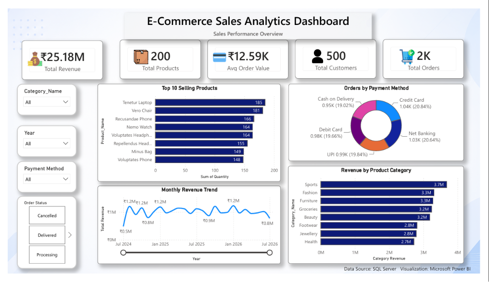
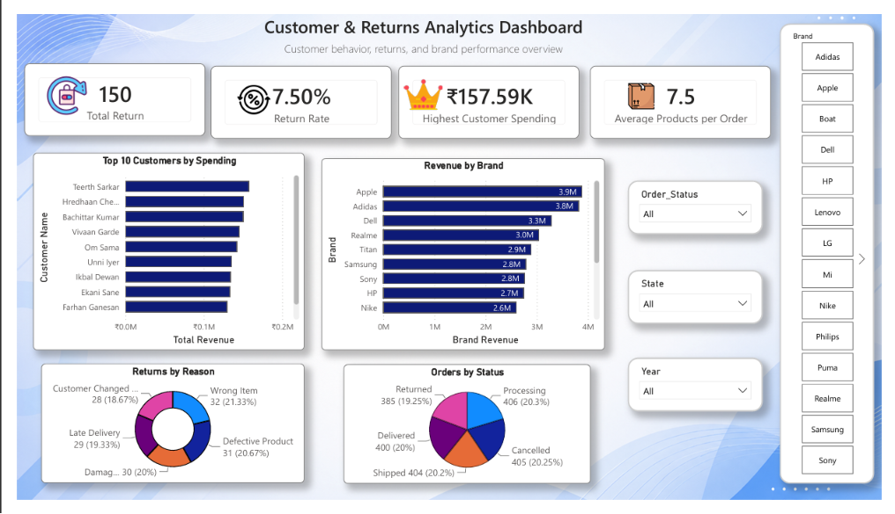

# 📊 E-Commerce Sales Analytics Dashboard

## 📌 Project Overview

This project is an interactive Power BI dashboard built to analyze e-commerce sales performance, customer behavior, and return trends. The dashboard transforms raw transactional data into actionable business insights using SQL Server, Power BI, Power Query, and DAX.

---

## 🛠 Tech Stack

- Microsoft Power BI
- SQL Server
- Power Query
- DAX
- Microsoft Excel

---

## 📂 Database Design

The project uses a normalized SQL Server database consisting of:

- Customers
- Categories
- Products
- Orders
- OrderDetails
- Returns

---

## 📈 Dashboard Features

### Sales Performance

- Total Revenue
- Total Orders
- Total Customers
- Average Order Value
- Top Selling Products
- Revenue by Category
- Monthly Revenue Trend
- Payment Method Analysis

### Customer & Returns Analysis

- Return Rate
- Top Customers by Spending
- Revenue by Brand
- Return Reasons
- Order Status Analysis

---

## 💡 Skills Demonstrated

- Data Cleaning
- Data Modeling
- SQL Database Design
- SQL Analysis Queries
- DAX Measures
- Power Query
- Interactive Dashboard Development
- Business Intelligence

---

## 📸 Dashboard Preview

### Sales Dashboard



### Customer & Returns Dashboard


---

## 📁 Repository Structure

```
PowerBI-Ecommerce-Sales-Analytics
│
├── Dashboard
├── Dataset
├── Images
├── SQL
└── README.md
```

---

## 👨‍💻 Author

Kuldeep
